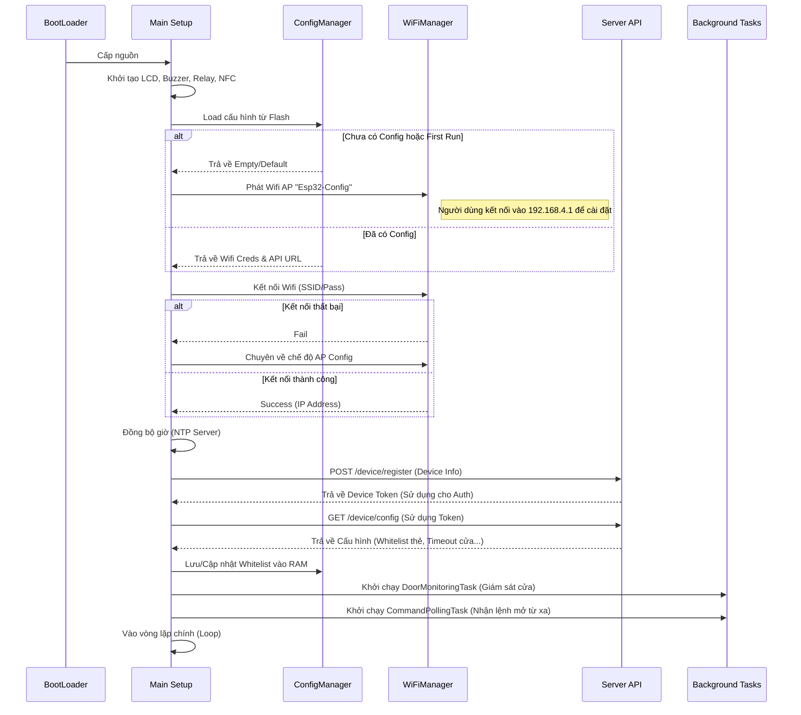
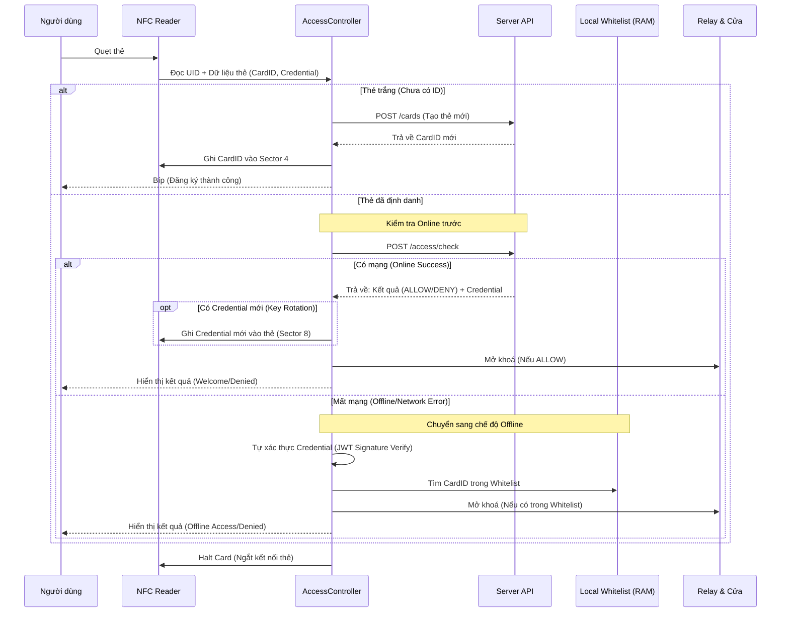

# Hệ thống Kiểm soát Ra vào Thông minh (IoT Access Control)

Hệ thống quản lý ra vào sử dụng thẻ từ NFC (RFID), tích hợp giám sát từ xa qua Internet. Hệ thống hoạt động tin cậy với chế độ Online/Offline tự động chuyển đổi.

## 🚀 Tính năng Nổi bật

1.  **Mở cửa đa phương thức**:
    - Quẹt thẻ NFC/RFID.
    - Nút nhấn vật lý (bên trong).
    - Điều khiển từ xa qua Dashboard (nếu có).
2.  **Hoạt động Hybrid (Online/Offline)**:
    - **Online**: Xác thực thẻ thời gian thực qua Server API.
    - **Offline**: Tự động sử dụng danh sách thẻ hợp lệ (Whitelist) được lưu trong bộ nhớ khi mất mạng.
3.  **Giám sát & Báo động**:
    - Phát hiện trạng thái cửa (Đóng/Mở) qua cảm biến từ.
    - Cảnh báo còi (Buzzer) khi cửa mở quá lâu hoặc bị cạy.
    - Hiển thị trạng thái chi tiết trên màn hình LCD.
4.  **Cấu hình Thông minh**:
    - Tự động phát Wifi Hotspot để cài đặt Wifi & API khi khởi động lần đầu.
    - Tự động đồng bộ cấu hình và danh sách thẻ từ Server.

## ⚙️ Cấu hình Phần cứng

| Linh kiện / Module         | Chân Nguồn / Tín hiệu | Đích đến (Kết nối với) | Ghi chú                 |
| :------------------------- | :-------------------- | :--------------------- | :---------------------- |
| **1. Nguồn & Động lực**    |                       |                        |                         |
| Nguồn 12V (Adapter)        | (+) 12V               | Relay: Chân **COM2**   | Nguồn dương cho khoá    |
|                            | (-) 12V               | Solenoid: Chân **(-)** | Nguồn âm chung          |
| Relay (Module)             | Chân **NO2**          | Solenoid: Chân **(+)** | Đóng ngắt khoá          |
| **2. Relay Module 2 Kênh** |                       |                        |                         |
| (Điều khiển khoá)          | VCC (+)               | Mạch: **5V**           | Nguồn nuôi Relay        |
|                            | GND (-)               | Mạch: **GND**          | Mass chung              |
|                            | IN1                   | ESP32: **GPIO25**      | Kênh dự phòng           |
|                            | IN2                   | ESP32: **GPIO26**      | Kênh điều khiển khoá    |
| **3. Khoá cửa MC38**       |                       |                        |                         |
| (Cảm biến từ)              | Dây 1                 | Mạch: **GND**          |                         |
|                            | Dây 2 (Signal)        | ESP32: **GPIO27**      | Phát hiện cửa đóng/mở   |
| **4. Màn hình LCD I2C**    |                       |                        |                         |
| (Hiển thị)                 | VCC                   | Mạch: **5V**           |                         |
|                            | GND                   | Mạch: **GND**          |                         |
|                            | SDA                   | ESP32: **GPIO32**      | Giao tiếp I2C           |
|                            | SCL                   | ESP32: **GPIO33**      | Giao tiếp I2C           |
| **5. Loa / Buzzer**        |                       |                        |                         |
| (Cảnh báo)                 | Chân (+)              | ESP32: **GPIO14**      | Passive (PWM Signal)    |
|                            | Chân (-)              | Mạch: **GND**          |                         |
| **6. Nút bấm (Button)**    |                       |                        |                         |
| (Mở cửa trong)             | Chân 1                | ESP32: **GPIO13**      | Input Pullup            |
|                            | Chân 2                | Mạch: **GND**          | Kích mức thấp (Low)     |
| **7. Đầu đọc NFC RC522**   |                       |                        |                         |
| (SPI Interface)            | 3.3V                  | Mạch: **3.3V**         | **Lưu ý: Không cắm 5V** |
|                            | GND                   | Mạch: **GND**          |                         |
|                            | RST                   | ESP32: **GPIO4**       | Reset                   |
|                            | SDA (SS)              | ESP32: **GPIO5**       | Chip Select             |
|                            | SCK                   | ESP32: **GPIO18**      | Clock                   |
|                            | MISO                  | ESP32: **GPIO19**      | Master In Slave Out     |
|                            | MOSI                  | ESP32: **GPIO23**      | Master Out Slave In     |

## 🧠 Logic Hoạt động

### 1. Khởi động (Boot)

- Hệ thống kiểm tra kết nối Wifi. Nếu không có Wifi đã lưu -> Phát Wifi `Esp32-Config` để người dùng vào cấu hình.
- Sau khi có Wifi, hệ thống đồng bộ thời gian thực (NTP).
- Đăng ký thiết bị với Server và tải cấu hình mới nhất (bao gồm Whitelist thẻ Offline).

### 2. Xử lý Thẻ NFC

- **Có mạng (Online)**: Gửi mã thẻ lên Server kiểm tra. Nếu hợp lệ -> Mở cửa.
- **Mất mạng (Offline)**: Kiểm tra mã thẻ trong bộ nhớ (Whitelist). Nếu có -> Mở cửa & Lưu log để gửi sau.

### 3. Nút bấm (Button)

- **Nhấn nhả (< 3s)**: Mở cửa lập tức (cho người bên trong đi ra).
- **Nhấn giữ (> 3s)**: Vào chế độ **Cấu hình (Config Mode)**. Reset Wifi để cài đặt lại.

## 8) Sơ đồ Nguyên lý (Mermaid Diagram)

```mermaid
graph TD
    %% Nguồn
    Power[Nguồn 12V] -->|12V+| Relay_COM2["Relay COM2"]
    Power -->|GND| Solenoid_Neg["(-) Solenoid"]

    %% Relay điều khiển khoá
    Relay_NO2["Relay NO2"] -->|"12V+ khi đóng"| Solenoid_Pos["(+) Solenoid"]

    %% ESP32 IO Connections
    ESP32[ESP32 Controller]

    %% Relay Module Connection
    ESP32 -->|GPIO25| Relay_IN1["Relay IN1"]
    ESP32 -->|GPIO26| Relay_IN2["Relay IN2"]

    %% Door Sensor
    Sensor["Cảm biến cửa MC38"] -->|Signal| ESP32_27[GPIO27]
    Sensor -->|GND| GND1[GND]

    %% Button
    Packet["Nút bấm"] -->|Signal| ESP32_13[GPIO13]
    Packet -->|GND| GND2[GND]

    %% Buzzer
    Buzzer["Còi (Passive)"] -->|PWM Signal| ESP32_14[GPIO14]
    Buzzer -->|GND| GND3[GND]

    %% LCD I2C
    ESP32 -->|GPIO32 - SDA| LCD_SDA["LCD SDA"]
    ESP32 -->|GPIO33 - SCL| LCD_SCL["LCD SCL"]

    %% NFC
    ESP32 -->|GPIO5| NFC_SS["NFC SDA/SS"]
    ESP32 -->|GPIO4| NFC_RST["NFC RST"]
    ESP32 -->|GPIO18| NFC_SCK["NFC SCK"]
    ESP32 -->|GPIO19| NFC_MISO["NFC MISO"]
    ESP32 -->|GPIO23| NFC_MOSI["NFC MOSI"]
```



## 9) Sơ đồ Đấu nối (Text Diagram)

```text
┌──────────────────────────────────┐          ┌──────────────────────────────────┐
│    VÙNG ĐỘNG LỰC (Dòng 12V)      │          │    VÙNG ĐIỀU KHIỂN (Logic)       │
│   (Chỉ dành cho Khóa & Relay)    │          │    (Dành cho ESP32 & Sensors)    │
└──────────────────────────────────┘          └──────────────────────────────────┘

    [ Adapter 12V ]                              [ Nguồn 5V (USB hoặc Sạc 5V) ]
        │      │                                                 │
        │(+)   └─(GND)──┐                                        │(5V)
        │               │                                        ▼
        ▼               ▼                                 ┌────────────┐
    ┌───────┐      ┌───────┐                              │   ESP32    │
    │ RELAY │      │ KHOÁ  │                              │ (Main MCU) │
    │(Kênh 2)      │SOLENOID                              └──┬──┬──┬───┘
    │       │      │       │                                 │  │  │
    │ [COM2]◄──────┤  (+)  │                          (3.3V) │  │  │ (5V)
    │       │      │       │                            ┌────┘  │  └────┐
    │ [NO2 ]──────►│  (-)  │                            │       │       │
    └───────┘      └───────┘                            ▼       │       ▼
        ▲                                        ┌────────────┐ │ ┌────────────┐
        │                                        │ RFID RC522 │ │ │  LCD I2C   │
        │ (Tín hiệu điều khiển)                  │ (SPI Bus)  │ │ │ (VCC, GND) │
        │                                        └────────────┘ │ └────────────┘
        │                                                       │
        │                            ┌───────────┬──────────────┼──────────────┐
        │                            │           ▼              ▼              ▼
        │      ┌────────────┐        │     ┌────────────┐ ┌────────────┐ ┌────────────┐
        └─────►│ RELAY (K2) │◄───────┘     │  LOA CÒI   │ │  NÚT BẤM   │ │ MC38 (Cửa) │
               │ (GPIO26)   │              │  (GPIO14)  │ │  (GPIO13)  │ │  (GPIO27)  │
               │ [VCC, GND] │              │ [GND, I/O] │ │ [GND, I/O] │ │ [GND, I/O] │
               └────────────┘              └────────────┘ └────────────┘ └────────────┘
                                                 │              │              │
                                                 └──────────────┴──────────────┘
                                                                │
                                                              [GND]
```

10. Luồng Hoạt động (Sequence Diagrams)

### 1. Khởi động & Cấu hình (Boot Process)

Luồng xử lý khi thiết bị bắt đầu cấp điện, bao gồm kết nối mạng và đồng bộ dữ liệu.



### 2. Xử lý Thẻ & Kiểm soát Ra vào (Core Access Logic)

Luồng chi tiết xử lý khi người dùng quẹt thẻ, bao gồm cả 2 trường hợp Online và Offline.


